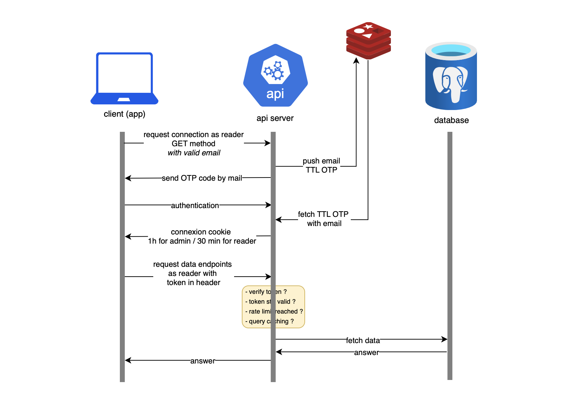
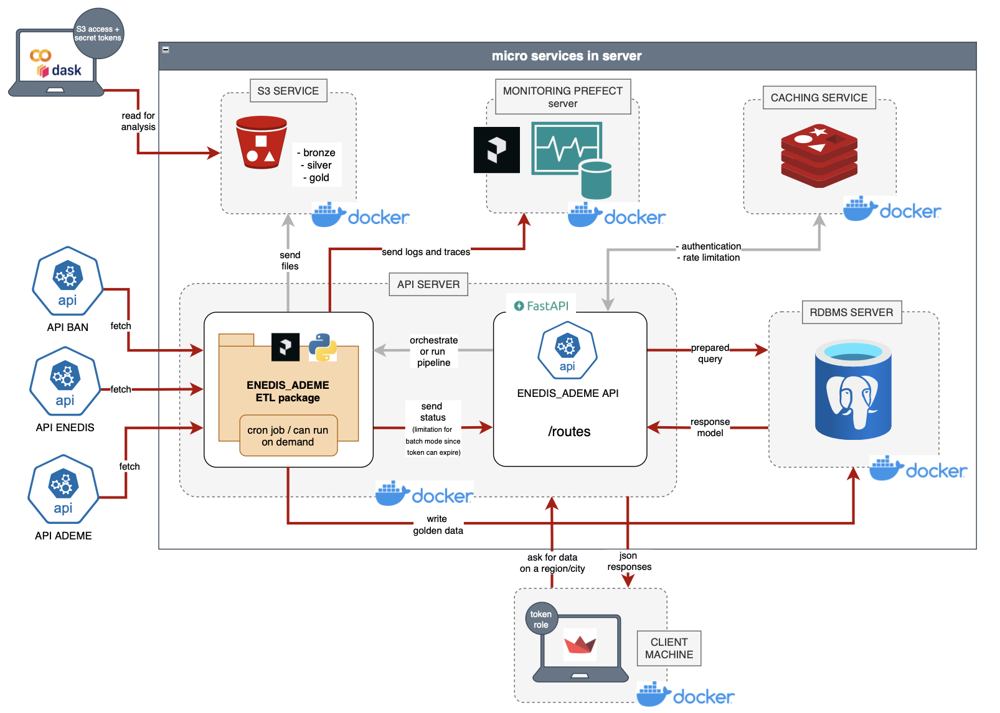
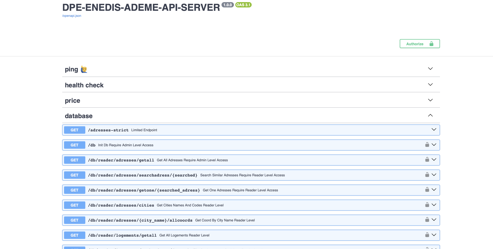

## DPE-Energy-Performance-Analysis-API-server

Git module API server pour DPE-Energy-Performance-Analysis.

[](https://github.com/fereol023/DPE-Energy-Performance-Analysis-API/actions/workflows/github-volt-api-cd.yml) [](https://github.com/fereol023/DPE-Energy-Performance-Analysis-API/actions/workflows/github-volt-api-ci.yml)

## 📑 Sommaire
1. [Description du projet](#description-du-projet)  
2. [Architecture et sécurité](#architecture-et-sécurité) 
3. [Pré-requis](#pré-requis)  
4. [Configuration](#configuration)  
5. [Lancer le serveur](#lancer-le-serveur)  
6. [Utilisation de l’API](#utilisation-de-lapi)  
7. [Authentification et rôles](#authentification-et-rôles)  
8. [Bonnes pratiques et sécurité](#bonnes-pratiques-et-sécurité)  
9. [Licence](#licence) 
10. [Contact](#contact)

---

### Description du projet
Ce projet expose une **API REST** permettant de consulter et d’analyser les données énergétiques issues des sources **Enedis**, **ADEME** et **BAN**.  
L’API est codée avec le framework **FastAPI** et s’intègre dans une architecture de microservices comprenant :
- Un serveur **PostgreSQL** pour la persistance des données,
- Un service de **cache Redis** pour gérer les OTP, limiter les requêtes et optimiser les performances,
- Un stockage **S3** (zones bronze, silver, gold) pour gérer les étapes de l’ETL,
- Un serveur de **monitoring Prefect** pour tracer et piloter les pipelines,
- Un module **ETL Python (ENEDIS_ADEME)** pour collecter, transformer et charger les données.

L’objectif principal : exposer uniquement des **données agrégées et anonymisées**, tout en garantissant la **sécurité, la gouvernance et la performance** des traitements.

---

### Architecture et sécurité
L’API agit comme **Data Access Layer** et interface unique avec la base de données.  
Les choix de conception assurent :
- Protection contre les **injections SQL** via requêtes préparées et validation des entrées,
- Gestion des **rôles et permissions** (lecteur vs admin),
- Utilisation de **tokens d’accès temporaires (OAuth2 + OTP)**,
- **Rate limiting** (1 requête / seconde par IP) pour limiter les risques de DDoS,
- Sécurisation des flux et cloisonnement des données sensibles (les adresses exactes ou identifiants de logements ne sont jamais exposés).

📌 Les données exposées sont des **moyennes de consommation énergétique (kWh/m²)** au niveau des logements, rues ou villes, sans identifiants directs et les caractéristiques des logements.  

📊 Diagrammes d’architecture (simplifiés) :  

<p align="center">
  
</p>

<p align="center">
  
</p>

---

### Pré-requis
- **Docker** et **Docker Compose** (recommandé pour lancer tous les services),
- Python 3.12 (si exécution locale sans Docker),
- PostgreSQL et Redis disponibles.

---

### Configuration
L’API repose sur des **variables d’environnement** définies dans un fichier [secrets.json](config/secrets.json.example).  

Exemple de configuration :

```env
# Environnement LOCAL ou NOLOCAL 
# si NOLOCAL l'API fonctionnera avec les microservices
# si LOCAL les fichiers seront stockés si possible sur la machine hôte

ENV=LOCAL

# API
API_HOST=0.0.0.0   # 0.0.0.0 (dans docker) ou localhost
API_PORT=8000

# Redis
REDIS_HOST=redis
REDIS_PORT=6379

# SMTP (pour envoi OTP par mail)
SMTP_SERVER=smtp.example.com
SMTP_PORT=465 # garder ce port car c'est du ssl qui est implémenté
SMTP_USERNAME=mailer@example.com
SMTP_PASSWORD=secret
ADMIN_EMAIL=admin@example.com

# PostgreSQL
POSTGRES_HOST=db
POSTGRES_PORT=5432
POSTGRES_DB_NAME=dpedb_v2
POSTGRES_ADMIN_USERNAME=postgres
POSTGRES_ADMIN_PASSWORD=password
POSTGRES_READER_USERNAME=reader
POSTGRES_READER_PASSWORD=password
POSTGRES_WRITER_USERNAME=writer
POSTGRES_WRITER_PASSWORD=password

# S3 Storage. Obligatoire ssi l'endpoint de run ETl est utilisé
S3_ACCESS_KEY=******
S3_SECRET_KEY=******
S3_BUCKET_NAME=dpe-storage-v1
S3_REGION=eu-west
S3_ENDPOINT_URL=http://minio:9000

# Prefect monitoring. Obligatoire ssi l'endpoint de run ETl est utilisé
PREFECT_API_URL=http://prefect:4200/api

# Chemins pour sauvegarder les runs de l'ETL. Obligatoire ssi l'endpoint de run est utilisé
PATH_LOG_DIR=etl/logs/
PATH_ARCHIVE_DIR=etl/data/archive/
PATH_DATA_BRONZE=etl/data/1_bronze/
PATH_DATA_SILVER=etl/data/2_silver/
PATH_DATA_GOLD=etl/data/3_gold/
PATH_FILE_INPUT_ENEDIS_CSV=etl/data/1_bronze/conso_enedis.csv
SCHEMA_ETL_INPUT_FILEPATH=config/schema_input_data.json
SCHEMA_SILVER_DATA_FILEPATH=etl/ressources/schemas/schema_silver_data.json
SCHEMA_GOLDEN_DATA_FILEPATH=config/schema_golden_data.json
```

---

### Lancer le serveur
0. Cloner le repos github avec :
```bash
git clone --recursive https://github.com/fereol023/DPE-Energy-Performance-Analysis-API.git
```
1. Avec Docker
```bash
docker build -t enedis-ademe-api .
docker run -p 8000:8000 --env-file .env enedis-ademe-api
```
2. Avec Docker Compose (services PostgreSQL + Redis inclus) (**recommandé**)
```bash
docker-compose up -d
```
Voir exemple de docker compose file [ici](docker-compose.yml).

3. Localement (développement après avoir mis le fichier des [secrets](config/secrets.json.example) dans le dossier config et installé les [requirements](requirements.txt))
```bash
python3 main.py --local
```
### Utilisation de l’API
Une fois démarrée, l’API est accessible sur :
👉 http://host:8000
Documentation interactive :
👉 http://host:8000/docs (Swagger UI)
👉 http://host:8000/redoc

➡️ Aperçu du swagger UI

<p align="center">
  
</p>

### Utilisation de l'ETL (endpoint)

---

### Authentification et rôles
- **Lecteur (reader)** : a accès aux routes de consultation (requêtes préparées uniquement). Bearer token valide 30 min (modifiable).
- **Administrateur (admin)** : accès supplémentaire aux routes de déclenchement d’ETL et monitoring. Bearer token valide 1h (modifiable) .
- **Sécurité OTP** : un code envoyé par mail est nécessaire à chaque nouvelle session.

### Bonnes pratiques et sécurité
- Utilisation stricte des requêtes préparées pour éviter les injections SQL,
- Implémentation d’un principe du moindre privilège (séparation rôles admin/lecteur),
- Mise en place d’un rate limiter pour prévenir les abus,
- Stockage des logs et traces pour audit et monitoring continu,
- Aucune donnée personnelle sensible n’est exposée : uniquement des agrégats énergétiques anonymisés et les caractéristiques du logement.

---

### Licence
Ce projet est distribué sous [licence GNU GPL3](LICENSE).

### Contact 
- E-mail : fereol.gbenou@ynov.com
- Page pro : [LinkedIn](https://www.linkedin.com/in/fereol-gbenou/)
